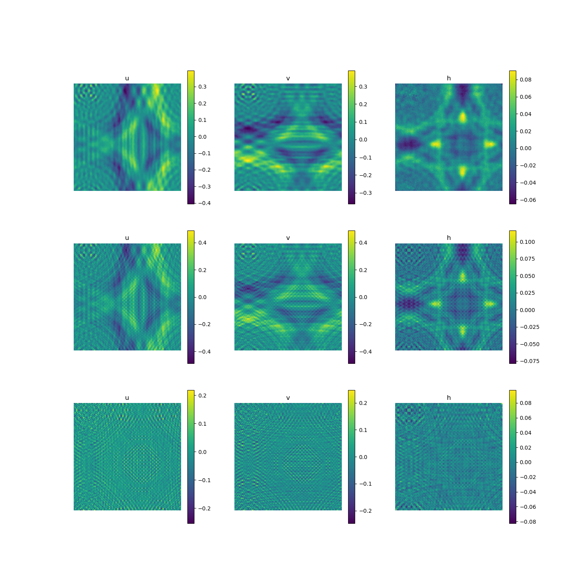

# shallow_water_ae

# reconstruct

# run

 modify ae.yaml -> run train_ae.py -> modify the path of saved models in test_recon.py -> run test_recon.py
 
# results

first row: recon, second row: ref, third row: err

