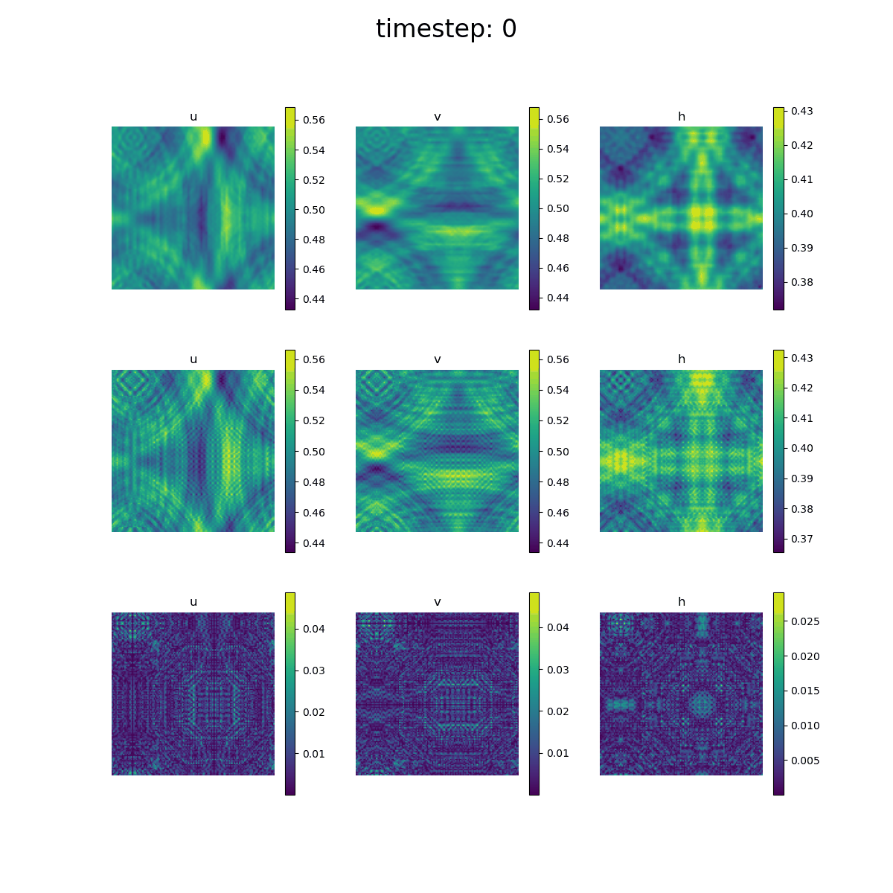

# shallow_water_ae

# 0 File tree

```
shallow_water_ae/
│
├── assets/
│   ├── pred_test_1.png
│   ├── pred_test_2.png
│   ├── pred_test_3.png
│   ├── pred_test.gif
│   └── recon_ae_test.png
│
├── data/
│   ├── minmax/
│   │   └── minmax_data.npy
│   │
│   ├── test/
│   │   ├── latent512/...
│   │   ├── R_14_Hp_5.npy
│   │   ...
│   │   └── R_30_Hp_17.npy
│   │
│   ├── train/
│   │   ├── latent512/...
│   │   ├── R_4_Hp_2.npy
│   │   ...
│   │   └── R_40_Hp_20.npy
│   │
│   └── val/
│       ├── latent512/
│       │   ├── ae_1/...
│       │   ...
│       │   ├── ae_3/...
│       │   ├── conditional_ae_1/...
│       │   ...
│       │   └── conditional_ae_6/
│       │       ├── R_10_Hp_3_latent.pt
│       │       ...
│       │       └── R_34_Hp_19_latent.pt
│       │
│       ├── R_10_Hp_3.npy
│       ...
│       └── R_34_Hp_19.npy
│
├── data_generate/
│   ├── config.yaml
│   ├── latent_data.py
│   ├── minmax.py
│   ├── shallow_water.py
│   └── shallow_water_vis.py
│
├── saved_models/
│   └── latent512/
│       ├── ae_1/...
│       ...
│       ├── ae_3/...
│       ├── conditional_ae_1/...
│       ...
│       ├── conditionala_ae_6/
│       │   ├── checkpoint_conditional_ae.pt
│       │   ├── conditional_ae_0_250.pt
│       │   ...
│       │   ├── conditional_ae_1499_250.pt
│       │   ├── conditional_ae_best.pt
│       │   ├── conditional_ae_best_epoch.pt
│       │   └── train_recon.yaml
│       │ 
│       └── lstm_1/
│           ├── ae_1/...
│           ...
│           ├── ae_3/...
│           ├── conditional_ae_1/...
│           ...
│           └── conditional_ae_6/..
│
├── ae.yaml
├── conv_ae.py
├── lstm.py
├── README.md
├── shallow_water_dataset.py
├── test_pred.py
├── test_recon.py
├── train_pred.py
└── train_recon.py
```

# 1 Generate data

## 1.1 Generate raw data

step1: modify `"Hp"` and `"R"`as needed (for train/val/test dataset) in `data_generate/config.yaml`.

step2: run `data_generate/shallow_water.py`, and then move all the generated data files to the corresponding folder (for
train/val/test dataset).

step3: repeat step1 and step2 as needed (for train/val/test dataset).

## 1.2 Generate min-max normalization data

step1: run `data_generate/minmax.py`, and then move the generated file to `data/minmax/`.

## 1.3 Generate latent data (after reconstruction has been done)

step1: modify `tag` to `"train"` or `"val"` or `"test"` as needed (for train/val/test dataset)
in `data_generate/latent_data.py`.

step2: modify trained-model-param path in `data_generate/latent_data.py`.

step3: repeat step1 and step2 as needed (for train/val/test dataset).

# 2 Reconstruct

## 2.1 Train cae model

step1: modify needed params in `ae.yaml`.

step2: run `train_recon.py`. (modify anything as needed in `train_recon.py`)

## 2.2 Test cae model

step1: modify trained-model-param path in `test_recon.py`.

step2: run `test_recon.py`. (modify anything as needed in `test_recon.py`)

## 2.3 Example of results on test dataset

first row: recon,
second row: ref,
third row: err


# 3 Predict

## 3.1 Train lstm model

step1: modify needed params in `ae.yaml`.

step2: run `train_pred.py`. (modify anything as needed in `train_pred.py`)

## 3.2 test lstm model

step1: modify trained-model-param path in `test_pred.py`.

step2: run `test_pred.py`. (modify anything as needed in `test_pred.py`)

## 3.3 Example of results on test dataset

first row: recon,
second row: ref,
third row: err



# Test error

